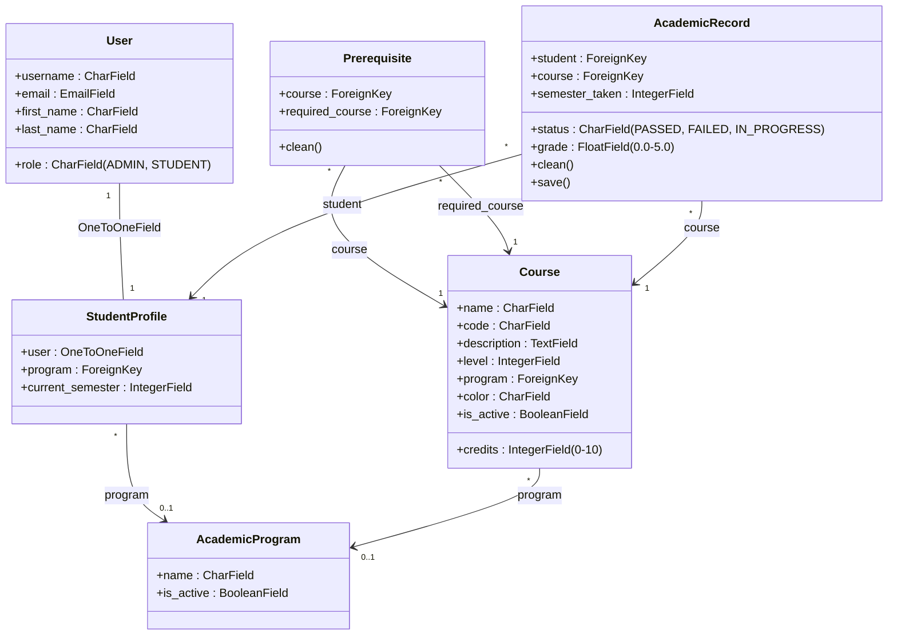

# Diagrama de Clases — EduPilot

A continuación se muestra el diagrama de clases del sistema con sus respectivos campos, tipos de relaciones y métodos principales de validación de negocio.

## Resumen de Relaciones y Reglas de Negocio Representadas

1. **`User` a `StudentProfile` (1:1):** Cada usuario con rol de estudiante tiene un perfil único que contiene su información académica.
2. **`AcademicProgram` (1:N):**
   * Un programa académico puede tener múltiples estudiantes matriculados (`StudentProfile`).
   * Un programa académico tiene un conjunto de materias (`Course`) que conforman su plan de estudios.
3. **`Course` y `Prerequisite` (Autorelación N:M):**
   * La clase intermedia `Prerequisite` relaciona una materia (`course`) con otra materia requerida (`required_course`).
   * **Validación de Ciclos (DFS):** El método `clean()` de `Prerequisite` ejecuta una búsqueda en profundidad para impedir ciclos de prerrequisitos (ej. que A requiera B, y B requiera A).
4. **`AcademicRecord` (Historial Académico):**
   * Relaciona a un `StudentProfile` con un `Course` para registrar notas, semestres de cursada y estados.
   * **Validación de Límites:** El método `clean()` asegura que la nota final esté entre `0.0` y `5.0`. También valida que un estudiante no intente cursar/reprobar una materia más de **3 veces**, activando la alerta de pérdida de calidad de estudiante en la plataforma.