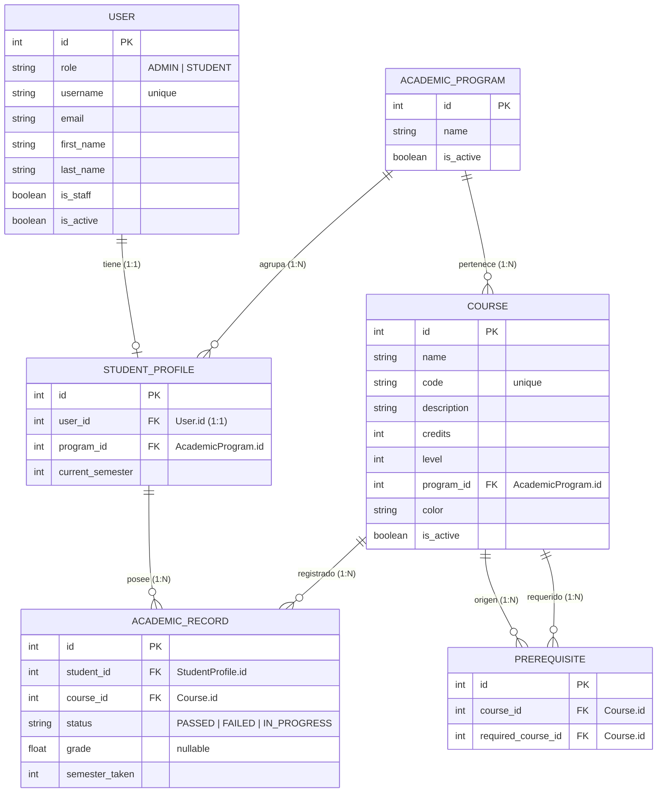

# Modelo Entidad-Relación (MER) — EduPilot

A continuación se presenta el Modelo Entidad-Relación (MER) físico de la base de datos relacional del sistema EduPilot utilizando la notación de pata de gallo (Crow's Foot) de Mermaid.

## Detalle del Modelo Físico y Llaves

### 1. Tabla `USER` (Autenticación)
*   **`id` (PK):** Identificador único del usuario autogenerado por Django.
*   **`role`:** Campo personalizado para diferenciar permisos del panel administrativo (`ADMIN`) y el del estudiante (`STUDENT`).
*   **`username`:** Nombre de usuario para el inicio de sesión único.

### 2. Tabla `STUDENT_PROFILE` (Perfil Académico)
*   **`user_id` (FK - 1:1):** Clave externa que se conecta con la tabla de `USER`. Su naturaleza `OneToOne` restringe que un usuario solo pueda tener un único perfil de estudiante.
*   **`program_id` (FK - N:1):** Permite asociar al estudiante con el programa académico del que cursa materias.

### 3. Tabla `COURSE` (Banco de Materias)
*   **`program_id` (FK - N:1):** Indica a qué plan de estudios/programa académico pertenece la asignatura.
*   **`code`:** Código institucional único para cada materia (ej. "INF01").

### 4. Tabla `PREREQUISITE` (Mesa de Prerrequisitos N:M)
*   Representa la relación de dependencia entre materias.
*   **`course_id` (FK):** Materia que tiene el candado.
*   **`required_course_id` (FK):** Materia que obligatoriamente se debe aprobar antes para desbloquear el candado.

### 5. Tabla `ACADEMIC_RECORD` (Matrículas e Historial)
*   **`student_id` (FK):** Perfil del estudiante dueño del registro.
*   **`course_id` (FK):** Materia a la que corresponde la nota/estado.
*   **`semester_taken`:** Semestre en el que se inscribió/cursó de forma real la asignatura.
